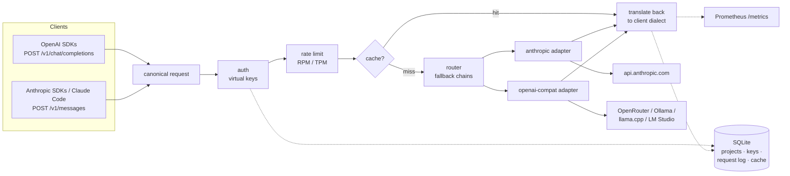

# llm-gateway

[](https://github.com/Damianen/llm-gateway/actions/workflows/ci.yml)

Self-hosted LLM gateway in Go: **one API for Anthropic, OpenRouter, and local models** — routing, fallback, cost tracking, caching, and metrics, in a single static binary with a single SQLite file.

Point every AI project you build at this gateway instead of at providers directly. You get one set of keys to revoke, one usage ledger, one place to swap models, and one dashboard-ready metrics endpoint — regardless of which SDK each project uses.

- **Two inbound APIs, every client works.** OpenAI-compatible `POST /v1/chat/completions` (+ `GET /v1/models`) and Anthropic-compatible `POST /v1/messages`. Any OpenAI SDK, any Anthropic SDK, and Claude Code (via `ANTHROPIC_BASE_URL`) can talk to it — to *any* backing model.
- **Two outbound adapters, every provider works.** Anthropic (`api.anthropic.com`) and anything OpenAI-compatible: OpenRouter, Ollama, llama.cpp, LM Studio — differing only in base URL and key.
- **Full translation both directions**, including streaming and tool calls: an OpenAI-dialect client can stream tool-call deltas from a Claude model and vice versa.
- **Fallback chains**: on upstream 429/5xx/timeout, the next entry in the chain serves the request; the log records who actually served it.
- **Cost tracking**: every request persists tokens, computed USD cost, latency, status, cache/fallback flags — queryable per project by model or day.
- **Virtual keys** (`sk-gw-…`, stored as SHA-256 hashes) grouped into projects, with per-key RPM/TPM rate limits and an admin API.
- **Exact-match response cache** (opt-in), served to streaming requests as a replayed stream. Cache hits cost $0.
- **Zero external services.** One binary, one YAML file, one SQLite database (WAL). Prometheus `/metrics`, structured JSON logs, graceful shutdown.

## Architecture



Both inbound dialects translate to one canonical request/response model; the router picks a provider adapter; adapters translate canonical ⇄ provider wire format. Everything a client sees — responses, errors, streams — is shaped like the API it spoke.

## Quickstart (5 minutes)

### 1. Run it

**Docker Compose:**

```sh
git clone https://github.com/Damianen/llm-gateway && cd llm-gateway/deploy
cp ../config.example.yaml ./config.yaml
# edit config.yaml: set `database.path: /data/gateway.db`, pick your models
echo "GATEWAY_ADMIN_TOKEN=$(openssl rand -hex 24)" > .env
echo "ANTHROPIC_API_KEY=sk-ant-..." >> .env
echo "OPENROUTER_API_KEY=sk-or-..." >> .env
docker compose up -d
```

**Or a plain binary** (systemd unit in [`deploy/llm-gateway.service`](deploy/llm-gateway.service)):

```sh
go build ./cmd/gateway
cp config.example.yaml config.yaml         # edit models/pricing
export GATEWAY_ADMIN_TOKEN=$(openssl rand -hex 24)
export ANTHROPIC_API_KEY=sk-ant-...
./gateway -config config.yaml
```

### 2. Create a project and a virtual key

```sh
curl -X POST -H "Authorization: Bearer $GATEWAY_ADMIN_TOKEN" \
  -d '{"name":"my-agents"}' http://localhost:8080/admin/projects

curl -X POST -H "Authorization: Bearer $GATEWAY_ADMIN_TOKEN" \
  -d '{"project":"my-agents","name":"dev laptop","rpm":60,"tpm":100000}' \
  http://localhost:8080/admin/keys
# → {"key":"sk-gw-...", ...}   the plaintext key is shown exactly once
```

### 3. Call it with any SDK

```sh
# OpenAI dialect
curl http://localhost:8080/v1/chat/completions \
  -H "Authorization: Bearer sk-gw-..." \
  -d '{"model":"sonnet","messages":[{"role":"user","content":"Hello!"}]}'

# Anthropic dialect
curl http://localhost:8080/v1/messages \
  -H "x-api-key: sk-gw-..." \
  -d '{"model":"sonnet","max_tokens":256,"messages":[{"role":"user","content":"Hello!"}]}'
```

### 4. Watch the money

```sh
curl -H "Authorization: Bearer $GATEWAY_ADMIN_TOKEN" \
  "http://localhost:8080/admin/usage?project=my-agents&group_by=model"
```

## Pointing Claude-API tools at the gateway

Anything that speaks the Anthropic API accepts a base URL override:

```sh
export ANTHROPIC_BASE_URL=http://gateway-host:8080
export ANTHROPIC_API_KEY=sk-gw-...          # your gateway virtual key
claude                                       # Claude Code now routes through the gateway
```

The `model` you request (`sonnet`, `fast`, or any alias you configured) is resolved by the gateway's registry — which may be backed by Anthropic directly, OpenRouter, or a local model.

## Adding a local model (Ollama)

Local servers are just OpenAI-compatible entries — no key needed:

```yaml
models:
  - name: local-hermes
    provider: openai
    upstream_model: hermes3:8b
    base_url: http://localhost:11434/v1
    pricing: { input_usd_per_mtok: 0, output_usd_per_mtok: 0 }
```

Now `{"model": "local-hermes"}` works from both inbound dialects — including from Claude Code.

## Configuration reference

See [`config.example.yaml`](config.example.yaml) for a complete annotated example.

| Key | Default | Meaning |
|---|---|---|
| `server.listen` | `:8080` | listen address |
| `server.request_timeout` | `120s` | whole non-streaming request, fallbacks included |
| `server.upstream_timeout` | `60s` | one upstream attempt (time-to-first-byte for streams) |
| `server.shutdown_grace` | `10s` | graceful shutdown window on SIGTERM |
| `server.log_level` | `info` | `debug`\|`info`\|`warn`\|`error` (JSON logs on stdout) |
| `server.log_bodies` | `false` | log request/response bodies (never headers/keys) |
| `server.default_max_tokens` | `1024` | applied when a client omits `max_tokens` |
| `database.path` | `data/gateway.db` | SQLite file (WAL mode); migrations run at startup |
| `cache.ttl` | `5m` | exact-match response cache TTL |
| `rate_limits.default_rpm/tpm` | `0` | per-key defaults; `0` = unlimited; override per key |
| `models[].name` | — | gateway-facing model name clients request |
| `models[].provider` | — | `anthropic` or `openai` (wire format) |
| `models[].upstream_model` | — | model id sent upstream |
| `models[].base_url` | — | `anthropic`: host root (gateway appends `/v1/messages`); `openai`: includes `/v1` (gateway appends `/chat/completions`) |
| `models[].api_key_env` | — | env var holding the upstream key; omit for local servers. Enabled models fail startup if the var is unset |
| `models[].pricing` | — | USD per million tokens (in/out), used for cost accounting |
| `models[].aliases` | — | extra names resolving to this entry (share its cache) |
| `models[].fallback` | — | model names tried in order on 429/5xx/timeout |
| `models[].enabled` | `true` | disabled entries 404 and are skipped in chains |

Secrets are environment-only: upstream keys via `api_key_env`, admin token via `GATEWAY_ADMIN_TOKEN`. Nothing secret is ever written to the database, config, or logs.

## Admin API

All endpoints require `Authorization: Bearer $GATEWAY_ADMIN_TOKEN` (constant-time compare). If the variable is unset, the admin API returns 503.

| Endpoint | Purpose |
|---|---|
| `POST /admin/projects` `{"name"}` | create a project |
| `GET /admin/projects` | list projects |
| `POST /admin/keys` `{"project","name","rpm","tpm","cache_default"}` | issue a virtual key (plaintext returned exactly once) |
| `GET /admin/keys?project=` | list keys (never exposes plaintext or hashes) |
| `POST /admin/keys/{id}/revoke` | revoke a key immediately |
| `GET /admin/usage?project=&from=&to=&group_by=model\|day` | aggregated requests, tokens, cost, cache hits, fallbacks |

`from`/`to` accept RFC3339 or `YYYY-MM-DD`; `to` is exclusive.

## Metrics reference

`GET /metrics` (Prometheus text format; also `GET /healthz` for liveness):

| Metric | Labels | Meaning |
|---|---|---|
| `gateway_requests_total` | project, model, provider, status | completed requests; rate-limited ones count as 429 |
| `gateway_request_duration_seconds` | project, model, provider, status | latency histogram (streams: full stream duration) |
| `gateway_tokens_total` | project, model, provider, direction | provider-reported tokens |
| `gateway_cost_usd_total` | project, model, provider | accumulated cost from configured pricing |
| `gateway_cache_hits_total` | project, model | requests served from cache |
| `gateway_fallbacks_total` | model, provider | requests served by a fallback entry |

## Accounting semantics

- Token counts come **only** from provider-returned usage; the gateway never tokenizes locally. Streams force `stream_options: {"include_usage": true}` on OpenAI-compatible upstreams and read `message_start`/`message_delta` on Anthropic, so streamed requests are costed identically to non-streamed ones. (Local servers that report no usage yield zero-token rows.)
- Cache hits record **0 tokens and $0** with `cache_hit=1` — token columns track upstream consumption.
- The request log records the provider and upstream model that **actually served** (fallbacks annotated), HTTP status (`499` = client disconnected mid-stream, `502` = upstream failed mid-stream), latency, and stream flag.
- TPM limiting debits **actual** usage after the response; a huge request may push the bucket negative and block the key until it refills. Rate-limited rejections are visible in metrics, not in the request log.

## Security notes

- Virtual keys are random 24-byte secrets stored as SHA-256 hashes; comparison is constant-time; plaintext appears exactly once in the create-key response and never in logs.
- Upstream provider keys live only in environment variables named by config; upstream auth failures are reported to clients as generic 502s.
- `Authorization` / `x-api-key` headers are never logged, including on error paths. `log_bodies` is off by default.
- `/metrics` and `/healthz` are unauthenticated — bind the gateway to an internal interface (LAN/VPN) or firewall those paths; this is a self-hosted service, not an internet-facing one.
- The container runs distroless as non-root; the systemd unit uses `DynamicUser` plus a strict sandbox.

## Translation notes & limitations

- Tool calls translate fully in both directions, streaming included (OpenAI `tool_calls` ⇄ Anthropic `tool_use`/`tool_result`, argument deltas ⇄ `input_json_delta`).
- Anthropic `tool_result.is_error` has no OpenAI equivalent; it is surfaced in-band as a `[tool error] ` content prefix.
- Multimodal content (images, documents) is rejected with 400 (out of scope for v0.1). Anthropic `thinking` blocks in request history are dropped; extended-thinking passthrough is not supported.
- OpenAI-dialect parameters without a canonical equivalent (`frequency_penalty`, `logprobs`, `response_format`, …) are ignored; `n > 1` is rejected.
- Upstream response IDs pass through (a Claude-served response keeps its `msg_…` id even on the OpenAI surface).

## Roadmap (deliberately not in v0.1.0)

- Semantic caching
- OpenTelemetry tracing
- Embeddings / images endpoints
- Web dashboard UI
- Hot config reload
- Anthropic prompt-caching passthrough
- Multimodal content

## Development

```sh
go vet ./...
go test -race ./...        # httptest fakes only, no real network
./scripts/smoke.sh         # full stack end-to-end against fake upstreams
```

Layout: `internal/provider` (canonical types + adapters), `internal/server` (inbound dialects, pipeline, admin), `internal/router`, `internal/store` (+ embedded `migrations/`), `internal/cache`, `internal/ratelimit`, `internal/metrics`, `internal/upstreamfake` (test doubles). Conventions and the build plan live in [CLAUDE.md](CLAUDE.md).

## License

[MIT](LICENSE)
